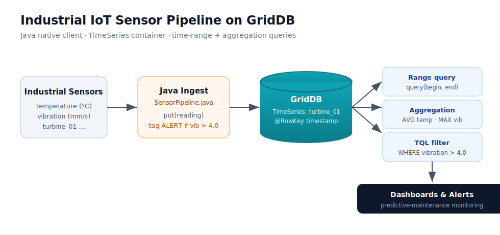

# GridDB IIoT Sensor Pipeline (Java)

A compact, working example of an industrial-IoT time-series pipeline built on [GridDB](https://www.griddb.net/) using its native Java client. It models a turbine sensor, ingests a stream of timestamped readings with inline anomaly tagging, and runs the range, aggregation, and TQL queries an industrial monitoring system actually needs.

Companion blog: **Building an Industrial IoT Sensor Pipeline with GridDB and Java** → `https://github.com/Soniya-hub/griddb-iiot-pipeline-java/blob/main/griddb-iiot-java-blog.md`



## What it shows

- **Schema-as-class** — a Java POJO with `@RowKey` defines the container schema
- **TimeSeries container** — one container per device (`turbine_01`)
- **Streaming ingest** — 60 minute-spaced readings, flagged `ALERT` when vibration crosses threshold
- **Time-range query** — `query(begin, end)` over the last hour
- **Server-side aggregation** — `AVG` temperature, `MAX` vibration
- **TQL filter** — `SELECT * WHERE vibration > 4.0`

## Requirements

- Java 11+
- A running GridDB cluster (default: cluster `myCluster` on `127.0.0.1:10001`) — see the [GridDB quickstart](https://github.com/griddb/griddb)
- GridStore Java client on the classpath

```xml
<dependency>
    <groupId>com.github.griddb</groupId>
    <artifactId>gridstore</artifactId>
    <!-- check Maven Central for the latest 5.x release -->
    <version>5.5.0</version>
</dependency>
```

## Run

```bash
javac -cp gridstore.jar SensorPipeline.java
java  -cp .:gridstore.jar SensorPipeline
```

Update the connection properties in `SensorPipeline.java` if your cluster name, host, or credentials differ.

## Author

Soniya — Senior Software Engineer (Java / Spring Boot · enterprise healthtech).
Portfolio: https://portfolio-eight-vert-70.vercel.app/
